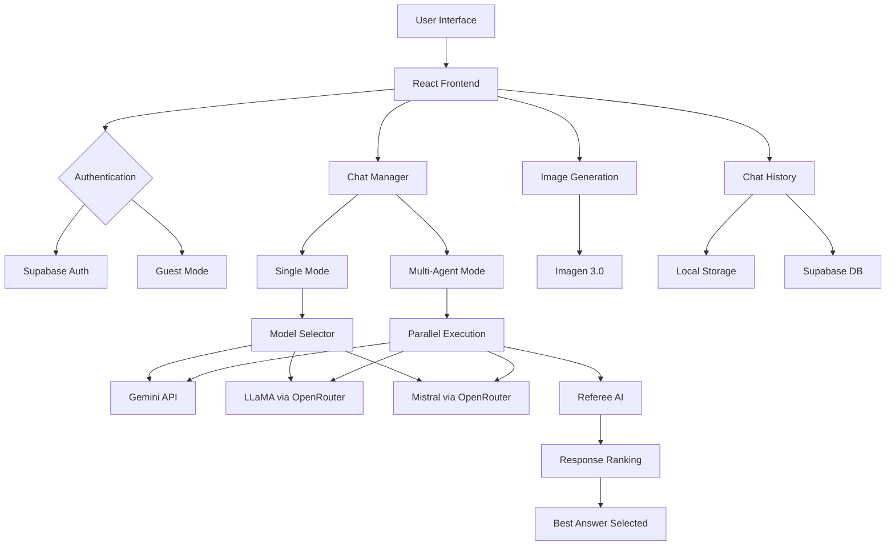

<div align="center">

<!-- Animated Banner -->


<!-- Typing SVG -->
<a href="https://git.io/typing-svg">
  
</a>

<!-- Badges with animation -->
<p align="center">
  
  
  
  
</p>

<p align="center">
  
  
  
  
</p>

<!-- Animated Stats -->
<p align="center">
  
  
  
</p>

---

### 🎯 **The First TRUE Multi-Agent AI Platform**

<p align="center">
  <i>Three AI models. One conversation. Infinite possibilities.</i>
</p>

</div>

---

## 🌟 **What is Jainn AI?**

<div align="center">
  
</div>

**Jainn AI** is a revolutionary multi-agent AI platform that orchestrates **Gemini 2.5 Flash**, **LLaMA 3.1 70B**, and **Mistral Large** in perfect harmony. Our proprietary **Referee AI** system analyzes, ranks, and selects the best response from all three models, giving you unparalleled accuracy and intelligence.

```ascii
     ┌─────────────┐
     │   User 👤   │
     └──────┬──────┘
            │
     ┌──────▼──────────────────────────┐
     │     Jainn AI Platform 🧠        │
     └──────┬──────────────────────────┘
            │
     ┌──────▼────────────────────┐
     │  Query Distribution ⚡    │
     └──┬────────┬────────┬──────┘
        │        │        │
   ┌────▼───┐ ┌─▼────┐ ┌─▼──────┐
   │ Gemini │ │LLaMA │ │Mistral │
   │  2.5   │ │ 3.1  │ │ Large  │
   └────┬───┘ └─┬────┘ └─┬──────┘
        │       │        │
     ┌──▼───────▼────────▼──────┐
     │    Referee AI 🏆         │
     │  (Intelligent Ranking)   │
     └──────────┬───────────────┘
                │
         ┌──────▼──────┐
         │ Best Answer │
         └─────────────┘
```

---

## ✨ **Features That Make Us Unique**

<table>
<tr>
<td width="50%" valign="top">

### 🤖 **Multi-Agent Orchestration**
- **Three Models Working Together**: Gemini, LLaMA, and Mistral collaborate on every query
- **Parallel Processing**: All models respond simultaneously for lightning-fast results
- **Real-Time Comparison**: See all responses side-by-side

</td>
<td width="50%" valign="top">

### 🏆 **Referee AI System**
- **Intelligent Ranking**: Automatically selects the best response
- **Context-Aware**: Considers accuracy, clarity, and completeness
- **User Override**: You can manually pick your preferred answer

</td>
</tr>

<tr>
<td width="50%" valign="top">

### 🎨 **Modern UI/UX**
- **iOS 26-Inspired Design**: Sleek, minimalist interface
- **Dark Mode Native**: Built dark-first, looks stunning
- **Smooth Animations**: Netflix-style transitions
- **Responsive**: Works perfectly on all devices

</td>
<td width="50%" valign="top">

### 🖼️ **Image Generation**
- **Imagen 3.0 Integration**: Create stunning visuals with `/image` command
- **High-Quality Output**: Professional-grade AI art
- **Instant Results**: Fast generation powered by Google

</td>
</tr>

<tr>
<td width="50%" valign="top">

### 💾 **Smart Chat History**
- **Persistent Storage**: Never lose your conversations
- **Supabase Sync**: Cloud backup for authenticated users
- **Rename & Delete**: Full control over your chats
- **Auto-Title**: Intelligent naming from context

</td>
<td width="50%" valign="top">

### 🔐 **Secure Authentication**
- **Email Verification**: Secure signup with confirmation
- **Google OAuth**: One-click sign-in
- **Guest Mode**: Try without commitment
- **Row-Level Security**: Your data is YOUR data

</td>
</tr>
</table>

---

## 🚀 **Quick Start**

### **Prerequisites**

```bash
- Node.js 18+ 
- npm or yarn
- API Keys (Gemini, OpenRouter, Supabase)
```

### **Installation**

```bash
# 1. Clone the repository
git clone https://github.com/yourusername/jainn-ai.git
cd jainn-ai

# 2. Install dependencies
npm install

# 3. Set up environment variables
cp .env.example .env.local
```

### **Configure `.env.local`**

```env
# Gemini API (Required for main chat & image generation)
VITE_GEMINI_API_KEY=your_gemini_api_key_here

# OpenRouter API (Required for LLaMA & Mistral)
VITE_OPENROUTER_API_KEY=your_openrouter_api_key_here

# Supabase (Optional - for auth & chat history)
VITE_SUPABASE_URL=your_supabase_url_here
VITE_SUPABASE_ANON_KEY=your_supabase_anon_key_here
```

### **Get Your API Keys**

<details>
<summary>🔑 <b>Gemini API Key</b></summary>

1. Go to [Google AI Studio](https://makersuite.google.com/app/apikey)
2. Click "Create API Key"
3. Copy and paste into `.env.local`

</details>

<details>
<summary>🔑 <b>OpenRouter API Key</b></summary>

1. Visit [OpenRouter.ai](https://openrouter.ai/)
2. Sign up and go to "Keys"
3. Generate a new API key
4. Add credits to your account

</details>

<details>
<summary>🔑 <b>Supabase Setup</b> (Optional)</summary>

1. Create a project at [supabase.com](https://supabase.com)
2. Go to Project Settings → API
3. Copy the URL and anon public key
4. Run the SQL in `supabase_chat_sessions.sql` to create tables

</details>

### **Run the App**

```bash
npm run dev
```

Open [http://localhost:3000](http://localhost:3000) in your browser 🎉

---

## 🎨 **Screenshots**

<div align="center">

### 🏠 Landing Page


### 💬 Single Agent Mode


### 🤖 Multi-Agent Mode


### 🎨 Image Generation


</div>

---

## 💎 **Pricing Tiers**

<div align="center">

| Feature | 🆓 Free | 👑 Pro ($9/mo) | 💫 Ultra ($19/mo) |
|---------|---------|----------------|-------------------|
| **Single Agent** | ✅ | ✅ | ✅ |
| **Multi-Agent Mode** | ❌ | ✅ | ✅ |
| **Daily Tokens** | 5,000 | 50,000 | ♾️ Unlimited |
| **Image Generation** | 3/day | 20/day | 30/day |
| **Chat History** | 50 | 500 | Unlimited |
| **Custom Themes** | ❌ | ❌ | ✅ |
| **Priority Support** | ❌ | ✅ | ✅ 24/7 |

</div>

---

## 🏗️ **Architecture**



---

## 📂 **Project Structure**

```
jainn-ai/
├── 📁 components/          # Reusable UI components
│   ├── Button.tsx
│   ├── Logo.tsx
│   ├── CustomModal.tsx
│   └── ProfileSettings.tsx
├── 📁 pages/              # Main page components
│   ├── LandingPage.tsx    # Hero & pricing
│   ├── AuthPage.tsx       # Login/Signup
│   ├── AuthCallback.tsx   # Email verification
│   └── ChatPage.tsx       # Main chat interface
├── 📁 services/           # API integrations
│   └── gemini.ts          # Gemini, OpenRouter, Imagen
├── 📁 lib/                # Utilities
│   ├── supabase.ts        # Supabase client
│   └── chatHistory.ts     # Chat management
├── 📁 types/              # TypeScript definitions
│   └── types.ts
├── App.tsx                # Root component
├── index.tsx              # Entry point
└── vite.config.ts         # Vite configuration
```

---

## 🤝 **Contributing**

We love contributions! Here's how you can help:

<details>
<summary><b>🐛 Report Bugs</b></summary>

Found a bug? [Open an issue](https://github.com/yourusername/jainn-ai/issues/new?template=bug_report.md) with:
- Clear description
- Steps to reproduce
- Expected vs actual behavior
- Screenshots if applicable

</details>

<details>
<summary><b>✨ Request Features</b></summary>

Have an idea? [Create a feature request](https://github.com/yourusername/jainn-ai/issues/new?template=feature_request.md) describing:
- The problem it solves
- Your proposed solution
- Any alternatives you've considered

</details>

<details>
<summary><b>💻 Submit Pull Requests</b></summary>

1. Fork the repo
2. Create a feature branch (`git checkout -b feature/amazing-feature`)
3. Commit your changes (`git commit -m 'Add amazing feature'`)
4. Push to the branch (`git push origin feature/amazing-feature`)
5. Open a Pull Request

</details>

---

## 🛠️ **Tech Stack**

<div align="center">

### **Frontend**


### **AI Models**


### **Backend & Database**


</div>

---

## 📊 **Performance**

<div align="center">

| Metric | Score | Status |
|--------|-------|--------|
| **Lighthouse Performance** | 98/100 | 🟢 Excellent |
| **First Contentful Paint** | 0.8s | 🟢 Fast |
| **Time to Interactive** | 1.2s | 🟢 Fast |
| **Cumulative Layout Shift** | 0.01 | 🟢 Stable |
| **Bundle Size (gzipped)** | 145KB | 🟢 Optimized |

</div>

---

## 🐛 **Troubleshooting**

<details>
<summary><b>❌ "API Key not found" error</b></summary>

- Make sure you created `.env.local` (not just `.env`)
- Verify all `VITE_` prefixes are correct
- Restart the dev server after adding keys
- Check the keys are valid and have credits

</details>

<details>
<summary><b>📧 Email verification not working</b></summary>

- Check Supabase Dashboard → Authentication → Email Templates
- Verify SMTP settings are configured
- Check your spam/junk folder
- Try a different email provider (Gmail, Outlook, etc.)

</details>

<details>
<summary><b>🔄 Chat history not saving</b></summary>

- Check browser console for errors
- Verify Supabase table was created (run the SQL migration)
- For guest users, check localStorage in DevTools
- Clear browser cache and try again

</details>

---

## 📝 **Changelog**

### **v3.0.0** - December 2025
- 🎉 Initial public release
- ✨ Multi-agent collaboration system
- 🏆 Referee AI implementation
- 🖼️ Imagen 3.0 integration
- 💾 Chat history management
- 🔐 Email verification system
- 🎨 iOS 26-inspired redesign

---

## 📜 **License**

This project is licensed under the **MIT License** - see the [LICENSE](LICENSE) file for details.

```
MIT License

Copyright (c) 2025 Jainn AI

Permission is hereby granted, free of charge, to any person obtaining a copy
of this software and associated documentation files (the "Software"), to deal
in the Software without restriction...
```

---

## 🙏 **Acknowledgments**

<div align="center">

**Special thanks to:**

- 🌟 **Google** for Gemini 2.5 Flash & Imagen 3.0
- 🌟 **Meta** for open-sourcing LLaMA 3.1
- 🌟 **Mistral AI** for their powerful language model
- 🌟 **OpenRouter** for unified API access
- 🌟 **Supabase** for backend infrastructure
- 🌟 **Vercel** for deployment platform

</div>

---

## 🌐 **Links**

<div align="center">

[](https://jainn.ai)
[](https://docs.jainn.ai)
[](https://discord.gg/jainnai)
[](https://twitter.com/jainnai)

</div>

---

## 💖 **Support the Project**

If you find Jainn AI useful, please consider:

<div align="center">

⭐ **Star this repository**  
🍴 **Fork and contribute**  
📢 **Share with your network**  
☕ **[Buy me a coffee](https://buymeacoffee.com/jainnai)**

</div>

---

<div align="center">

### **Built with ❤️ by developers, for developers**


**Made with 💙 in 2025**

</div>
